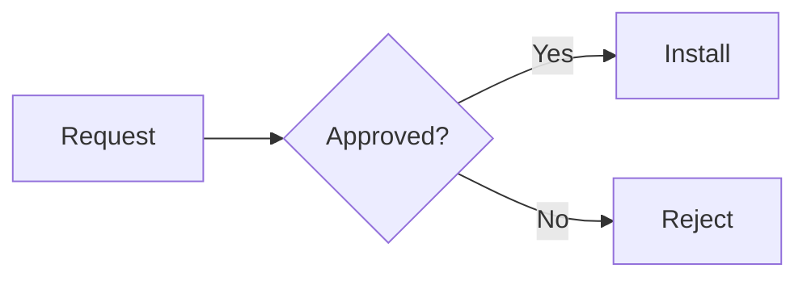

# Preview appearance fixture

Paragraph with **bold**, _italic_, `inline code`, and a [link](https://example.com).

> Blockquote

| Mode  | Result   |
| ----- | -------- |
| Light | Readable |
| Dark  | Readable |

```bash
sudo apt update
git status
```

```typescript
const appearance: 'light' | 'dark' = 'dark';
```




---
